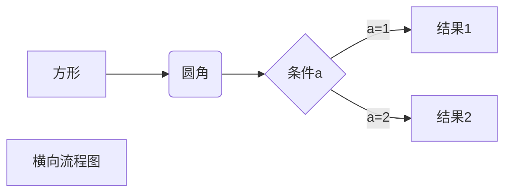
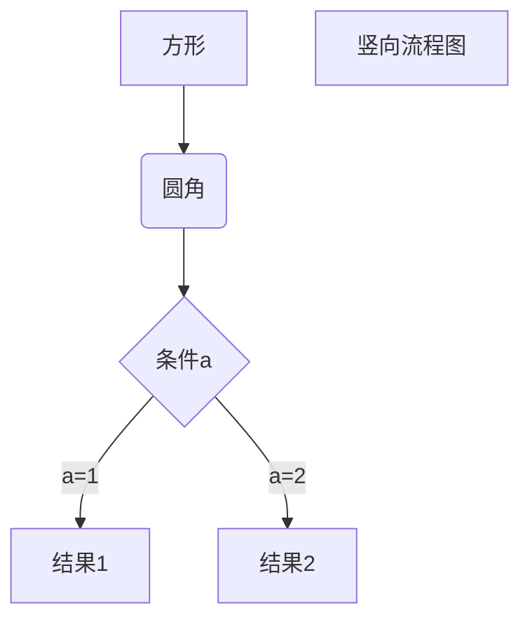
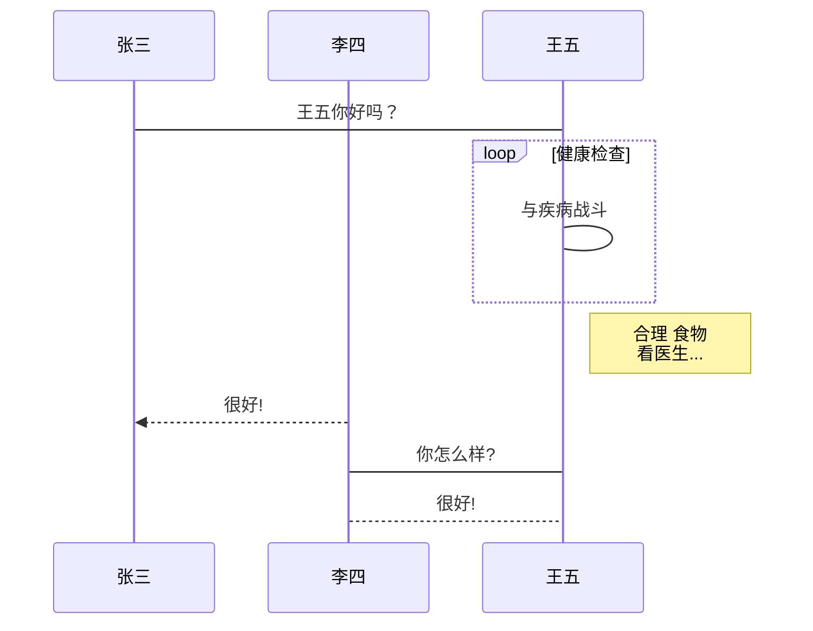
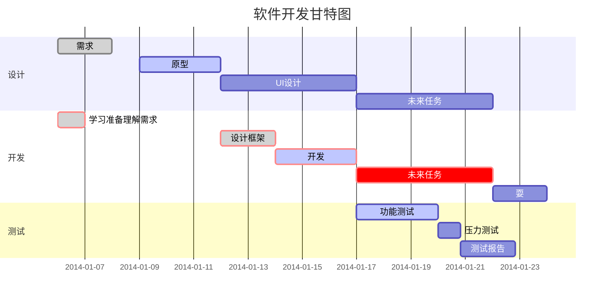

# 标题
我是一级标题
=================

我是二级标题
-----------------


# 一级标题
## 二级标题
### 三级标题
#### 四级标题
##### 五级标题
###### 六级标题


# 字体

*斜体文本*
_斜体文本_
**粗体文本**
__粗体文本__
***粗斜体文本***
___粗斜体文本___


# 分割线


***

* * *

*****

- - -


# 删除线

~~我是一个带删除线的内容~~


# 下划线

<u>我是一个带下划线的内容</u>


# 注脚

注脚显示位置[^RUNOOB]

[^RUNOOB]: 我是一个注脚信息，请及时查看！！！


# 列表

* 第一项
* 第二项
* 第三项

+ 第一项
+ 第二项
+ 第三项


- 第一项
- 第二项
- 第三项


1. 第一项
2. 第二项
3. 第三项


1. 第一项：
    - 第一项嵌套的第一个元素

    - 第一项嵌套的第二个元素
2. 第二项：
    - 第二项嵌套的第一个元素
    - 第二项嵌套的第二个元素


```
- 嵌套列表
 + 嵌套列表
 + 嵌套列表
  - 嵌套列表
   * 嵌套列表
- 嵌套列表
```


- 嵌套列表
  + 嵌套列表
  + 嵌套列表
    - 嵌套列表
      - 嵌套列表

- 嵌套列表


# 区块

> 区块引用


> 最外层
> > 第一层嵌套
> >
> > > 第二层嵌套


> 区块中使用列表
> 1. 第一项
> 2. 第二项
> + 第一项
> + 第二项
> + 第三项


* 第一项
    
    菜鸟教程
    
    > 学的不仅是技术更是梦想
* 第二项


# 代码

`printf()` 函数


## JavaScript

```javascript
$(document).ready(function () {
    alert('RUNOOB');
});
```


## Java

```java
package com.guohualife.cdp.hive.udtf;

import java.util.ArrayList;

import org.apache.hadoop.hive.ql.udf.generic.GenericUDTF;
import org.apache.hadoop.hive.ql.exec.UDFArgumentException;
import org.apache.hadoop.hive.ql.exec.UDFArgumentLengthException;
import org.apache.hadoop.hive.ql.metadata.HiveException;
import org.apache.hadoop.hive.serde2.objectinspector.ObjectInspector;
import org.apache.hadoop.hive.serde2.objectinspector.ObjectInspectorFactory;
import org.apache.hadoop.hive.serde2.objectinspector.StructObjectInspector;
import org.apache.hadoop.hive.serde2.objectinspector.primitive.PrimitiveObjectInspectorFactory;

public class MapUDTF extends GenericUDTF {

    @Override
    public void close() throws HiveException {
        // TODO Auto-generated method stub
    }

    @Override
    public StructObjectInspector initialize(ObjectInspector[] args)
            throws UDFArgumentException {
        if (args.length != 1) {
            throw new UDFArgumentLengthException("ExplodeMap takes only one argument");
        }
        if (args[0].getCategory() != ObjectInspector.Category.PRIMITIVE) {
            throw new UDFArgumentException("ExplodeMap takes string as a parameter");
        }

        ArrayList<String> fieldNames = new ArrayList<String>();
        ArrayList<ObjectInspector> fieldOIs = new ArrayList<ObjectInspector>();
        fieldNames.add("col1");
        fieldOIs.add(PrimitiveObjectInspectorFactory.javaStringObjectInspector);
        fieldNames.add("col2");
        fieldOIs.add(PrimitiveObjectInspectorFactory.javaStringObjectInspector);

        return ObjectInspectorFactory.getStandardStructObjectInspector(fieldNames, fieldOIs);
    }

    @Override
    public void process(Object[] args) throws HiveException {
        String input = args[0].toString();
        String[] str = input.split(";");
        for (int i = 0; i < str.length; i++) {
            try {
                String[] result = str[i].split(":");
                forward(result);
            } catch (Exception e) {
                continue;
            }
        }
    }
}
```


## shell

```sh
$ echo 'Something'
$ echo -e '\tSomething\n'
```


# 链接

这是一个链接 [菜鸟教程](https://www.runoob.com)

<https://www.runoob.com>


这个链接用1作为网址变量[Google][1]

![GitHub Octocat][2]


[1]: http://www.google.com/
[2]:http://static.runoob.com/images/runoob-logo.png


# 图片


# 表格

| 表头   | 表头   |
| ------ | :----- |
| 单元格 | 单元格 |
| 单元格 | 单元格 |


| 左对齐 | 右对齐 | 居中对齐 |
| :----- | -----: | :------: |
| 单元格 | 单元格 |  单元格  |
| 单元格 | 单元格 |  单元格  |


# html

使用 <kbd>Ctrl</kbd>+<kbd>Alt</kbd>+<kbd>Del</kbd> 重启电脑


<!-- 注释 -->


|| *Year* || *Temperature (low)* || *Temperature (high)* ||
|| 1900 || -10 || 25 ||
|| 1910 || -15 || 30 ||
|| 1920 || -10 || 32 ||


**文本加粗**

\*\* 正常显示星号 \*\*


$$
\mathbf{V}_1 \times \mathbf{V}_2 =  \begin{vmatrix} 
\mathbf{i} & \mathbf{j} & \mathbf{k} \\
\frac{\partial X}{\partial u} &  \frac{\partial Y}{\partial u} & 0 \\
\frac{\partial X}{\partial v} &  \frac{\partial Y}{\partial v} & 0 \\
\end{vmatrix}
${$tep1}{\style{visibility:hidden}{(x+1)(x+1)}}
$$


# 流程图-横向



# 流程图-竖向



# 标准流程图-竖向

```flow
st=>start: 开始框
op=>operation: 处理框
cond=>condition: 判断框(是或否?)
sub1=>subroutine: 子流程
io=>inputoutput: 输入输出框
e=>end: 结束框
st->op->cond
cond(yes)->io->e
cond(no)->sub1(right)->op
```

# 标准流程图-横向

```flow
st=>start: 开始框
op=>operation: 处理框
cond=>condition: 判断框(是或否?)
sub1=>subroutine: 子流程
io=>inputoutput: 输入输出框
e=>end: 结束框
st(right)->op(right)->cond
cond(yes)->io(bottom)->e
cond(no)->sub1(right)->op
```

# UML时序图

```sequence
对象A->对象B: 对象B你好吗?（请求）
Note right of 对象B: 对象B的描述
Note left of 对象A: 对象A的描述(提示)
对象B-->对象A: 我很好(响应)
对象A->对象B: 你真的好吗？
```

# UML时序图-复杂

```sequence
Title: 标题：复杂使用
对象A->对象B: 对象B你好吗?（请求）
Note right of 对象B: 对象B的描述
Note left of 对象A: 对象A的描述(提示)
对象B-->对象A: 我很好(响应)
对象B->小三: 你好吗
小三-->>对象A: 对象B找我了
对象A->对象B: 你真的好吗？
Note over 小三,对象B: 我们是朋友
participant C
Note right of C: 没人陪我玩
```

# UML标准时序图 



# 甘特图




